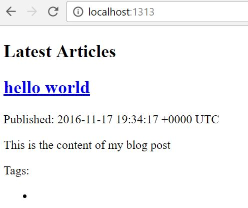

In [the last article](/article/2016/11/blog-building-part-1-hello-hugo/), we setup our workflow and all the pieces that you will need to create a new site. Now we need to install a theme and begin publishing. Prior to writing this series, I began evaluating the extensibility of hugo themes and started work on something I call bones - a no thrills template with no styling, just structure. As I improve the template it will become more useful, maybe. It will remain the template behind mysite as I continue to improve it.
<!--more-->
## Installing a theme

To install a theme, you need to know the repositories git url. You can see additional themes at [http://themes.gohugo.io/](http://themes.gohugo.io/). I will be using my [bones theme](https://github.com/Im5tu/hugo-bones.git) as the base.

Once you have the themes git url:

- Open the command line to repository that has our generation files in it
- Change directories to the themes folder
- Clone the git repo to this location, eg: `git clone https://github.com/Im5tu/hugo-bones.git`

Once the repository is cloned, we need to tell hugo how to use our new theme. To do this we need to open the `config.toml` file inside of the root directory and create an entry called theme. When this is done, your config file should look something along the lines of the following:

``` c#
baseurl = "http://example.org/"
title = "My New Hugo Site"
languageCode = "en-us"
theme = "hugo-bones"
```

Whilst I am here, I am going to change the other properties accordingly:

``` c#
baseurl = "https://im5tu.io/"
title = "Stuart Blackler's Tech Blog"
languageCode = "en-us"
theme = "hugo-bones"
```

Don't forget to save the file. It's also probably a good idea to commit your progress as you go.

## Creating our first post

Now that we have our theme all setup, we should probably create a hello world post. Assuming that you are using the bones theme like me, we can go back the root of our repository and run this command to generate a new post: `hugo new article\hello-world.md`. This creates a file under the `content\article` directory.

We can preview this site by running the command: `hugo server -D` and navigating to `http://localhost:1313/`. All being well you should see the following:



One of the great things about hugo is that it has live reload capabilities built in. This means that we can navigate to the page that we want to edit in the browser and everytime we make a change to the file, it will be synced to the screen. Try it! This magic happens because we called `hugo server` which, in a way, breaks down to mean:

- `hugo`: build my site please
- `server`: load a simple http server with my content

Additionally, I added the flag `-D` which means that I want to build draft posts. In the template that I created, I wanted to create everything as a draft so that I could work on it in isolation and be safe in the knowledge that I wouldn't accidently post something that wasn't ready.

## Additional configuration

Before I finish up this post and write more, I want to change a few of the configuration options. Personally, I like working with json rather than yaml/toml inside of the markdown files, it feels more natural to me. Other changes that I wish to make include: changing permalink styles, output verbosity and enabling the robots.txt file.

In order to make these changes, we need to once more open the `config.toml` file and add the properties as follows:

``` c#
baseurl = "https://im5tu.io/"
title = "Stuart Blackler's Tech Blog"
languageCode = "en-us"
theme = "hugo-bones"
metaDataFormat = "json"
enableRobotsTXT = true
[permalinks]
 article = "article/:year/:month/:title/"
```

## Next steps

One of the next things that I will be doing is working with the template to ensure that everything is setup in terms of category/tag pages, rss feeds etc. This, although unstyled, will be enough to begin pushing to the live site.

After that is complete, I will be setting up gulp to build, clean and minify my javascript and css files. From there I can start working on the visual styling of the site. I will blog the entire process, but this may take some time as I figure out exactly what I want.

Finally, it's setting up Github and Cloudflare so that everyone can enjoy an SSL enabled site around the world at blazing speeds.
