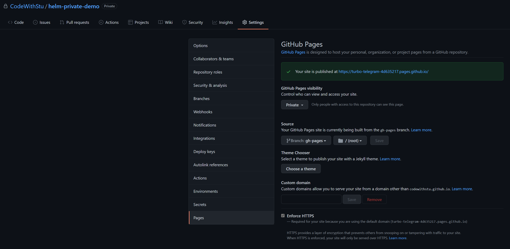
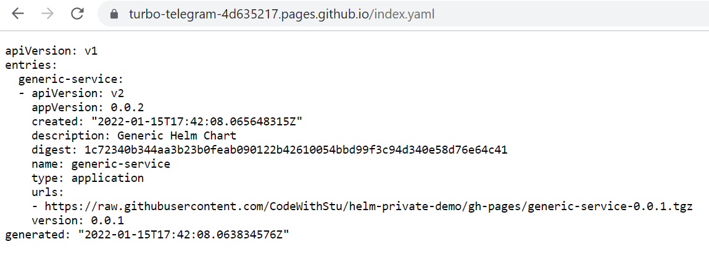
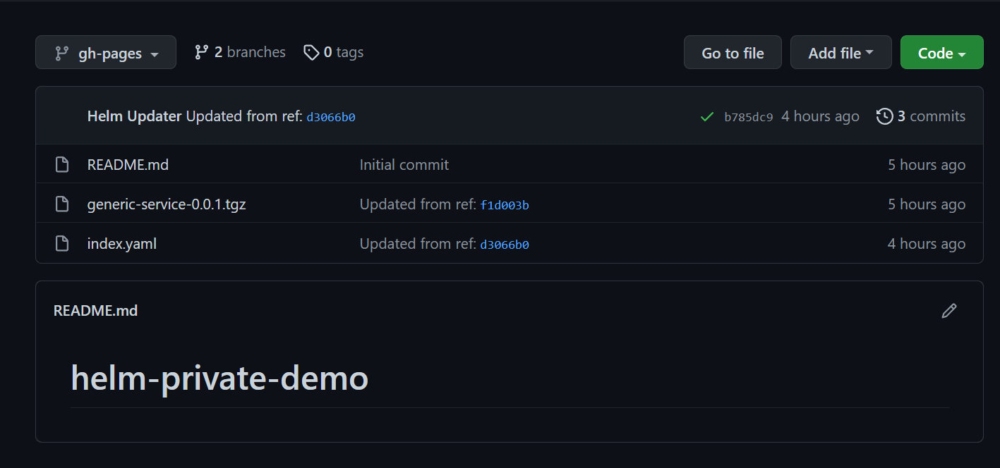

<!--  -->

In this article, we're going to take a look at how to create a private Helm repository with Github Pages. This guide requires you to have a Github Enterprise license as private Github Pages are only available to enterprise customers. I'm showing this approach for the scenarios where setting up something like [ChartMuseum](https://chartmuseum.com/) isn't possible or unwanted. Although this guide uses helm as the example, you can extend this to host anything under a privately authenticated Github page.

<!--more-->

## Prerequisites

For this approach to work, you need to have the following in place:

1. A private Github repository as part of a [Github Enterprise](https://github.com/enterprise)
1. 2 branches setup in the repository:
    * main - This is where your chart source lives
    * gh-pages - This is where the charts are published
1. A personal access token (PAT) that can access the repository

## Setup Github Pages

Once you have the prerequisites in place, you will need to setup your Github Pages with the following settings:



The key parts of the setup are:

1. Ensure that the repository pages are set to private
2. The branch is set to `gh-pages` at the root

Please note that your URL that Github generates for you will be different and you do not actually need this URL for the rest of the tutorial.

## Publish Action

Helm relies on an index file that tells us the location of all the charts for a given repository and provides their download links. To build our index, we need to update it as soon as we push to the `main` branch. Let's take a look at the following Github Action:

```yaml
name: Release Helm Charts

# Do not change this
concurrency: release-helm

on:
  workflow_dispatch:
  push:
    branches:
      - main

jobs:
  release:
    runs-on: ubuntu-latest
    steps:
      - name: Checkout
        uses: actions/checkout@v2
        with:
          path: 'src'
          fetch-depth: 0
      - name: Checkout
        uses: actions/checkout@v2
        with:
          path: 'dest'
          ref: 'gh-pages'
          fetch-depth: 0

      - name: Install Helm
        uses: azure/setup-helm@v1

      - name: Package Helm Charts
        shell: bash
        run: |
          find src/charts/ -type f -name 'Chart.yaml' | sed -r 's|/[^/]+$||' | sort | uniq | xargs -L 1 helm dep up
          for d in src/charts/*/ ; do
              echo "$d"
              helm package "$d" -u -d dest
          done
      - name: Push New Files
        shell: bash
        working-directory: dest
        run: |
          helm repo index . --url https://raw.githubusercontent.com/CodeWithStu/helm-private-demo/gh-pages/
          git config user.name "Helm Updater"
          git config user.email "actions@users.noreply.github.com"
          git add $(git ls-files -o --exclude-standard)
          git add index.yaml
          git commit -m "Updated from ref: $GITHUB_SHA"
          git push
```

Starting from the top, we have `concurrency: release-helm`. This tells Github that only a single instance of this action should be run as once, this is because later on we will be publishing the action to a different branch and git will get confused if we tried to do this in parallel. Next, we checkout two different branches, one for `main` and one for `gh-pages`:

```yaml
- name: Checkout
  uses: actions/checkout@v2
  with:
    path: 'src'
    fetch-depth: 0
- name: Checkout
  uses: actions/checkout@v2
  with:
    path: 'dest'
    ref: 'gh-pages'
    fetch-depth: 0
```

This is so that we can easily use standard git commands to push files to a branch. The next interesting part is where we package the helm charts:

```yaml
- name: Package Helm Charts
  shell: bash
  run: |
      find src/charts/ -type f -name 'Chart.yaml' | sed -r 's|/[^/]+$||' | sort | uniq | xargs -L 1 helm dep up
      for d in src/charts/*/ ; do
          echo "$d"
          helm package "$d" -u -d dest
      done
```

Here we look in the charts directory of `src`, which is where we cloned our `main` branch in to, and run `helm dep up` on each of the charts that we find, including subcharts. This ensures that we have everything that we need to package the chart.

When packaging the chart, we put it in the `dest` folder which is the folder we cloned our `gh-pages` branch to. This contains all of the charts from the `main` branch packaged alongside the helm index file.

In order to commit all of this back to git we use the following set of commands:

```yaml
- name: Push New Files
  shell: bash
  working-directory: dest
  run: |
      helm repo index . --url https://raw.githubusercontent.com/CodeWithStu/helm-private-demo/gh-pages/
      git config user.name "Helm Updater"
      git config user.email "actions@users.noreply.github.com"
      git add $(git ls-files -o --exclude-standard)
      git add index.yaml
      git commit -m "Updated from ref: $GITHUB_SHA"
      git push
```

`helm repo index` creates the new index file, or updates it when it already exists, based on the contents of the `gh-pages` branch. Note the URL that's specified, which means that all content comes from here. Without this, helm will not work. It also **must** be a `raw.githubusercontent.com` address not the randomly generated URL from the pages settings. This is because this endpoint supports the basic authentication required for the private feed.

`git add $(git ls-files -o --exclude-standard)` basically tells git to add any files that it thinks have been changed/added, before we run standard git commands to commit and push. To push, we do need to specify the name/email of the user that's committing, though this can be anything that you want.

Once the action has published, you should be able to access the generated helm index in your browser (you may need to authenticate with your normal github login or with your PAT token):



And you'll see this in your repository on the `gh-pages` branch:



## Using with Helm

To use the generated index with helm, you need to supply the `https://raw.githubusercontent.com` address we used earlier to helm, along with your username and generated PAT token:

```bash
helm repo add private https://raw.githubusercontent.com/CodeWithStu/helm-private-demo/gh-pages/ --username <Your Username> --password <Your PAT token>
helm repo update
```

This will use Github basic authentication to pull the index and allow you to search and use the repository. The result will look something similar to the following:

```bash
> helm search repo private
NAME                    CHART VERSION   APP VERSION     DESCRIPTION
private/generic-service 0.0.1           0.0.2           Generic Helm Chart
```

From here you are free to use your new helm repository as if it was any other helm repository. Enjoy!
