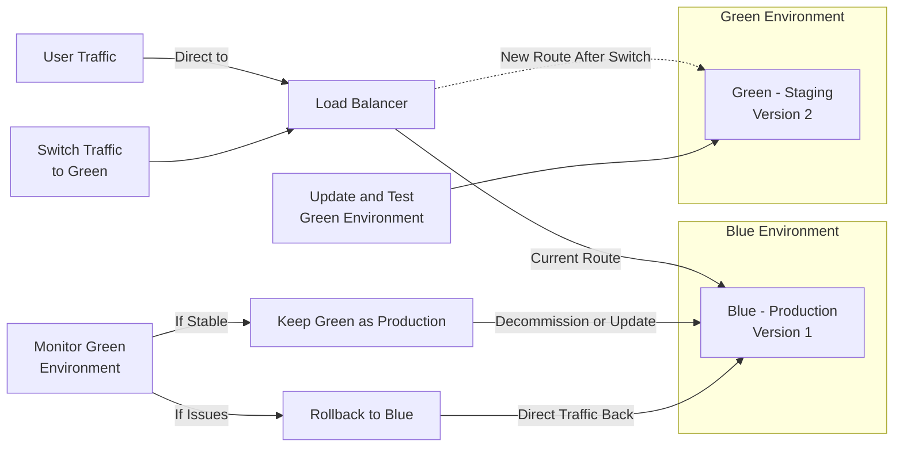

Lorem ipsum dolor sit amet, consectetur adipiscing elit. Mauris aliquam posuere ultrices. Proin et nulla mattis ipsum luctus gravida at eu ante. Vivamus vitae sodales elit. Cras ut pretium odio. Aenean varius vulputate orci vitae commodo. Aenean at sapien tincidunt, imperdiet tortor nec, molestie leo. Nullam nec finibus felis, in mollis lorem. Nullam ac odio nec est eleifend faucibus ut eu ante. Integer nisl augue, hendrerit eu convallis non, tincidunt vel felis. Curabitur diam nulla, porttitor nec dapibus id, volutpat sit amet lorem.

<!--more-->

## Best Practices

### Operational Excellence

Lorem ipsum dolor sit amet, consectetur adipiscing elit. Mauris aliquam posuere ultrices. Proin et nulla mattis ipsum luctus gravida at eu ante. Vivamus vitae sodales elit. Cras ut pretium odio. Aenean varius vulputate orci vitae commodo. Aenean at sapien tincidunt, imperdiet tortor nec, molestie leo. Nullam nec finibus felis, in mollis lorem. Nullam ac odio nec est eleifend faucibus ut eu ante. Integer nisl augue, hendrerit eu convallis non, tincidunt vel felis. Curabitur diam nulla, porttitor nec dapibus id, volutpat sit amet lorem.

### Security

Lorem ipsum dolor sit amet, consectetur adipiscing elit. Mauris aliquam posuere ultrices. Proin et nulla mattis ipsum luctus gravida at eu ante. Vivamus vitae sodales elit. Cras ut pretium odio. Aenean varius vulputate orci vitae commodo. Aenean at sapien tincidunt, imperdiet tortor nec, molestie leo. Nullam nec finibus felis, in mollis lorem. Nullam ac odio nec est eleifend faucibus ut eu ante. Integer nisl augue, hendrerit eu convallis non, tincidunt vel felis. Curabitur diam nulla, porttitor nec dapibus id, volutpat sit amet lorem.

### Reliability

Lorem ipsum dolor sit amet, consectetur adipiscing elit. Mauris aliquam posuere ultrices. Proin et nulla mattis ipsum luctus gravida at eu ante. Vivamus vitae sodales elit. Cras ut pretium odio. Aenean varius vulputate orci vitae commodo. Aenean at sapien tincidunt, imperdiet tortor nec, molestie leo. Nullam nec finibus felis, in mollis lorem. Nullam ac odio nec est eleifend faucibus ut eu ante. Integer nisl augue, hendrerit eu convallis non, tincidunt vel felis. Curabitur diam nulla, porttitor nec dapibus id, volutpat sit amet lorem.

### Performance Efficiency

Lorem ipsum dolor sit amet, consectetur adipiscing elit. Mauris aliquam posuere ultrices. Proin et nulla mattis ipsum luctus gravida at eu ante. Vivamus vitae sodales elit. Cras ut pretium odio. Aenean varius vulputate orci vitae commodo. Aenean at sapien tincidunt, imperdiet tortor nec, molestie leo. Nullam nec finibus felis, in mollis lorem. Nullam ac odio nec est eleifend faucibus ut eu ante. Integer nisl augue, hendrerit eu convallis non, tincidunt vel felis. Curabitur diam nulla, porttitor nec dapibus id, volutpat sit amet lorem.

### Cost Optimization

Lorem ipsum dolor sit amet, consectetur adipiscing elit. Mauris aliquam posuere ultrices. Proin et nulla mattis ipsum luctus gravida at eu ante. Vivamus vitae sodales elit. Cras ut pretium odio. Aenean varius vulputate orci vitae commodo. Aenean at sapien tincidunt, imperdiet tortor nec, molestie leo. Nullam nec finibus felis, in mollis lorem. Nullam ac odio nec est eleifend faucibus ut eu ante. Integer nisl augue, hendrerit eu convallis non, tincidunt vel felis. Curabitur diam nulla, porttitor nec dapibus id, volutpat sit amet lorem.

### Sustainability

Lorem ipsum dolor sit amet, consectetur adipiscing elit. Mauris aliquam posuere ultrices. Proin et nulla mattis ipsum luctus gravida at eu ante. Vivamus vitae sodales elit. Cras ut pretium odio. Aenean varius vulputate orci vitae commodo. Aenean at sapien tincidunt, imperdiet tortor nec, molestie leo. Nullam nec finibus felis, in mollis lorem. Nullam ac odio nec est eleifend faucibus ut eu ante. Integer nisl augue, hendrerit eu convallis non, tincidunt vel felis. Curabitur diam nulla, porttitor nec dapibus id, volutpat sit amet lorem.

## Applying Best Practices With A Policy

Lorem ipsum dolor sit amet, consectetur adipiscing elit. Mauris aliquam posuere ultrices. Proin et nulla mattis ipsum luctus gravida at eu ante. Vivamus vitae sodales elit. Cras ut pretium odio. Aenean varius vulputate orci vitae commodo. Aenean at sapien tincidunt, imperdiet tortor nec, molestie leo. Nullam nec finibus felis, in mollis lorem. Nullam ac odio nec est eleifend faucibus ut eu ante. Integer nisl augue, hendrerit eu convallis non, tincidunt vel felis. Curabitur diam nulla, porttitor nec dapibus id, volutpat sit amet lorem.
