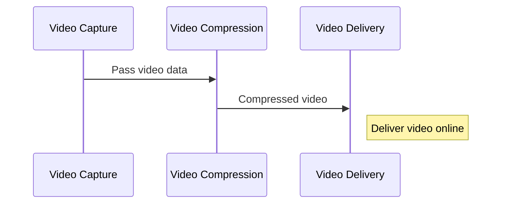
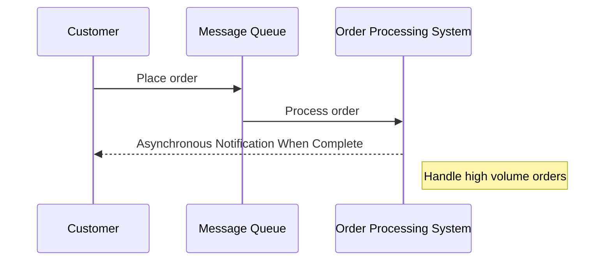

Asynchronous Request-Reply is a communication pattern in cloud computing where a request is sent to a service without requiring an immediate response. The reply is received asynchronously, allowing the system to handle other tasks in the meantime. This pattern enhances efficiency and scalability by decoupling the request and response processes.

<!--more-->



Visualize being at a lively café. You order at the counter and instead of standing around for your coffee, you receive a buzzer. You find a seat, chat with a friend, or scroll through your phone, and when your coffee is ready, the buzzer alerts you. This is similar to the asynchronous request-reply pattern. Within a digital system, the client (akin to you in the café) submits a request (like an order) to the server (the equivalent of the barista) and doesn’t wait for the request response (comparable to the coffee), but engages in other tasks instead. The server processes the request and sends a response when ready. This decoupling of request and response allows both the client and server to operate efficiently, without having to wait for each other.

## How to implement the asynchronous request response pattern

Putting into action the asynchronous request-reply pattern resembles arranging a relay race. The initial synchronous method call from the client to the API is the starting pistol shot. The API acknowledges the receipt of the request, much like the first runner accepting the baton and the race is on. The backend starts processing the request through a remote procedure call, akin to the runner racing to the next checkpoint.

The client, meanwhile, can check for updates or wait for notifications from the backend, much like spectators waiting for updates on the race. Once the processing is done, the backend sends the final response to the client, similar to the final runner crossing the finish line.

On the client-side, the request response pattern is implemented by initiating a request to the server and waiting for a corresponding response. This allows the client to proceed with other tasks while waiting for the server’s response, just like a relay race spectator can enjoy other aspects of the event while waiting for the race to finish.

### Backend API Implementation

The creation of backend APIs that support the asynchronous request-reply pattern can be likened to laying out the course for a relay race. A messaging system is used to manage the communication, much like marking the relay course to guide the runners. Incoming requests are processed asynchronously within backend services, akin to each runner taking their turn. Once the processing is complete, responses are published to the designated channel, similar to announcing the race results.

When the asynchronous work is complete, the status endpoint either provides a final resource indicating completion or issues a redirect to a newly created resource, similar to the race referee declaring the race results at the end. However, implementing the pattern may present challenges, such as handling message delivery failures and diagnosing issues within distributed systems, much like managing a relay race can present challenges like coordinating between different teams and managing unexpected disruptions.

### Client-Side Integration

Incorporating the asynchronous request-reply pattern into client-side applications equates to getting the spectators ready for the relay race. Asynchronous functions and event-driven programming allow the client to enjoy other aspects of the event while waiting for the race results, similar to spectators enjoying snacks or cheering for their team while waiting for the race to finish.

To implement the pattern, libraries like Axios and Redux Thunk can be used, much like using binoculars or a loudspeaker to enhance the spectator experience. Robust error handling ensures that the spectators are informed about any disruptions, while WebSockets enable real-time updates about the race progress, enhancing the overall spectator experience.

## When to use the asynchronous request-reply pattern

The asynchronous request-reply pattern proves most effective in situations more comparable to a marathon than a sprint. For long running operation or background processes that take minutes or even hours to complete, this pattern proves beneficial. It’s like having a relay team participate in a marathon - while one runner is on the course, the others can rest, strategize, or do other tasks, and take over when it’s their turn.

For instance, consider the scenario of a financial institution conducting intricate risk analysis on a large dataset. Using the asynchronous pattern, the frontend can initiate the request and proceed with other tasks, while the backend processes the data asynchronously, much like a relay team managing a marathon.

## When not to use the asynchronous request-reply pattern

Just as a relay team might be ill-suited for a sprint race, the asynchronous request-reply pattern might not work well in situations that demand immediate, real-time responses. If API calls are expected to respond within a very short time frame, the inherent latency in asynchronous communication due to message queuing and processing might exceed the required response time threshold, making asynchronous request response less effective in an asynchronous request response conversation.

### Non-Blocking Workflows

A non-blocking workflow resembles a relay race where each participant can commence their part as soon as the preceding one concludes, without waiting for all other teams to complete their corresponding legs. This allows the race to proceed smoothly, without bottlenecks. Non-blocking workflows in system design allow multiple operations to progress simultaneously, enabling efficient resource utilization and improved performance.

The asynchronous request-reply pattern, also known as the asynchronous request response pattern, enhances non-blocking workflows by separating the request processing from the sender, much like separating individual relay race legs allows each runner to focus on their part without worrying about the others.

### Independent Scaling

Independent scaling within a microservices architecture can be equated to a relay team, wherein each runner independently modifies their speed and strategy, contingent on the race conditions. This allows each microservice to scale up or down according to its individual requirements, providing greater flexibility and efficiency in resource allocation.

The asynchronous request-reply pattern facilitates independent scaling by enabling the client process and the backend services to scale independently, much like each runner in a relay team can adjust their strategy independently based on their individual performance and the team’s overall strategy.

## Challenges

Just as organizing and overseeing a relay race can pose challenges, so too can implementing the asynchronous request-reply pattern. These include delayed or missing responses, lack of immediate feedback, and potential communication issues between distributed system components, similar to challenges like coordinating between different teams, managing unexpected disruptions, and ensuring fair play in a relay race.

### Handling Errors and Timeouts

Addressing errors and timeouts within an asynchronous system is similar to managing interruptions during a relay race. If a runner gets injured or loses the baton, the race doesn’t stop. Instead, there are rules and strategies in place to handle such situations and ensure that the race continues.

Similarly, in an asynchronous request-reply system, robust error handling mechanisms such as retries or alternative workflows can help address errors, timeouts, and other disruptions. Just like a good relay team, an efficient asynchronous system is prepared to handle unexpected events and still ensure smooth operation.

### Supporting Legacy Clients

Accommodating legacy clients while putting the asynchronous request-reply pattern into action is akin to inviting a conventional race team to join a relay race. It requires some adjustments, like introducing a facade over the asynchronous API to shield the original client from the asynchronous processing, similar to providing additional training and resources to the traditional race team to adjust to the relay format.

Just as the traditional race team can benefit from participating in the relay race, legacy clients can also benefit from the asynchronous request-reply pattern. It enables them to separate backend processing from the client interface, improving communication efficiency and scalability.

## Best Practises

Just as there are recommended practices for orchestrating a triumphant relay race, there are also suggested methods for effectively applying the asynchronous request-reply pattern. These include:

- Using messaging queues for decoupling sender and receiver
- Setting and handling timeouts effectively
- Implementing robust error handling

### Designing the system for scalability and performance

Just like a well-organized relay race uses clear markings for the course, defined roles for each participant, and timely announcements for updates, implementing the asynchronous request-reply pattern effectively requires clear definitions of message formats, tracking of requests and replies, and regular monitoring and troubleshooting.

## Real-World Examples and Use Cases

Just as comprehending the rules of a relay race is simplified by observing a race, understanding the asynchronous request-reply pattern is made easier when viewing real-world examples.

Several industries, ranging from video processing pipelines to e-commerce order processing, utilize this pattern to achieve efficient and scalable operations.

### Video Processing Pipeline

Take into account a video processing pipeline where sequential steps such as capturing the video stream, implementing video compression, and delivering the video online are performed. Implementing the asynchronous request-reply pattern in this pipeline is like having a relay team where each runner performs a specific part of the race. Each runner (task) takes their turn, passing on the baton (video data) to the next, without blocking the other runners.

### E-commerce Order Processing

Within an e-commerce order processing system, the asynchronous request-reply pattern assists in managing high volumes of orders. When a customer places an order, the order information is sent to a message queue, much like a relay runner passing the baton to the next runner. The order processing system, like the next runner, then takes over and processes the order.

The pattern allows the system to:

- Process multiple orders simultaneously
- Avoid blockages or slowdowns
- Handle multiple race segments simultaneously, much like a well-coordinated relay team.

